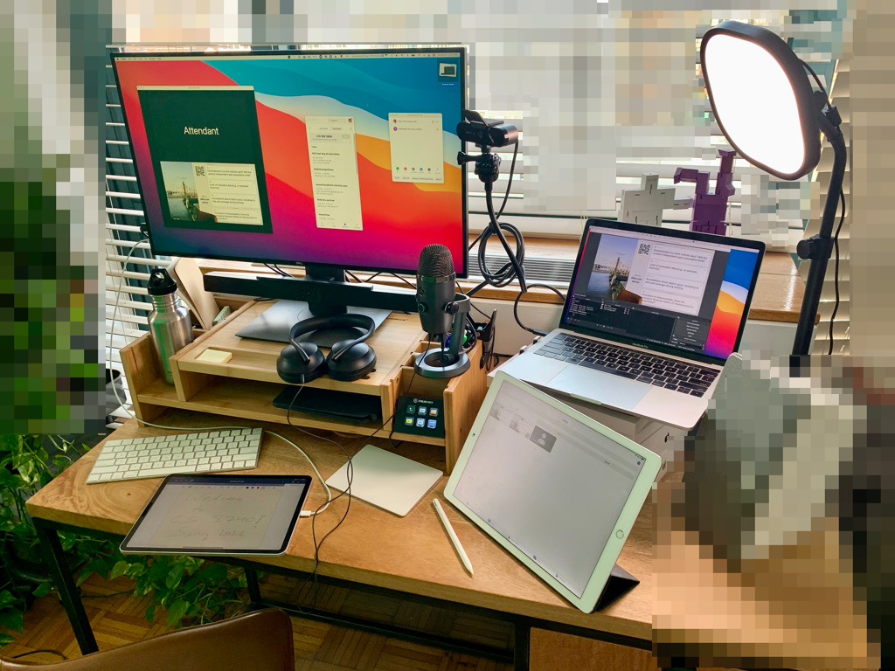
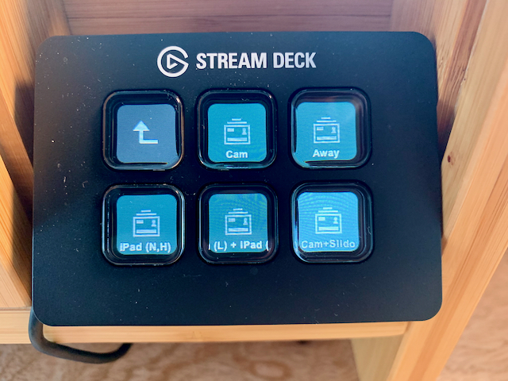
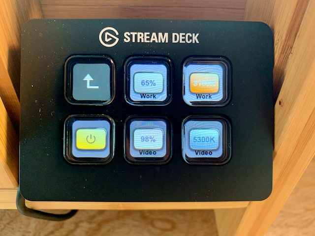
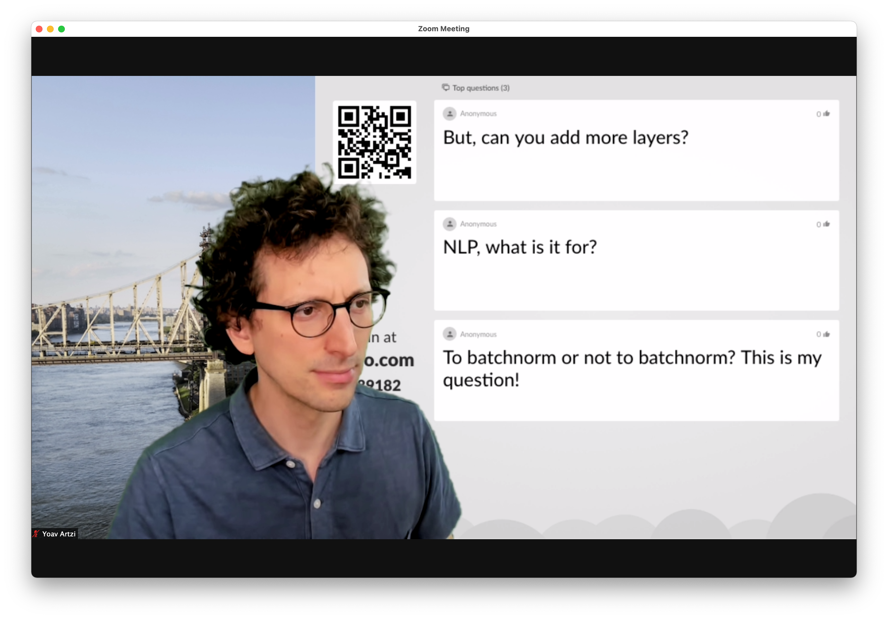

# Remote Teaching Setup - Spring 2021

This document is inspired by Sasha Rush's [setup document](https://github.com/srush/VirtualTeaching) and follows up on my [Spring 2020 setup post](). The setup is inspired by Sasha Rush and Harald Haraldsson.

Please use the [discussion board](/discussions) for any questions, or simply [open an issue](/issues).

## Constraints

- Interactive teaching
- Very limited space
- Moderate budget

## Equipment

- Webcam arm: [Flexible gooseneck Tripod](https://www.amazon.com/Webcam-Scissor-Adjustable-Flexible-gooseneck/dp/B08B5GSS7Z/) (~$20)
- Microphone: [Blue Yeti Nano](https://www.bluemic.com/en-us/products/yeti-nano/) ($100)
- OBS control: [Elgato Stream Deck Mini](https://www.elgato.com/en/gaming/stream-deck-mini) ($80)
- Light: [Elgato Key Light Air](https://www.elgato.com/en/gaming/key-light-air) ($130)
- Green screen: [Angler PortaScreen (Chroma Green)](https://www.bhphotovideo.com/c/product/1502655-REG/angler_pbb_cg57_background_porta_screen_chroma.html?fromDisList=y) ($125)

I also use the following equipment that I already had:

- Webcam: [Logitech Brio](https://www.logitech.com/en-us/product/brio)
- Headphones: [Bose Headphones 700](https://www.bose.com/en_us/products/headphones/noise_cancelling_headphones/noise-cancelling-headphones-700.html) (wired connection to mic)
- Laptop: Macbook Pro 13''
- External monitor: Dell 27''
- Two iPads

Overall cost is around $450, not including existing items.



### Equipment Positioning

I position the camera at eye level, on the right side of my main monitor. My Zoom window usually takes the right half of my main display. Because of my OBS layout it creates the illusion that I am looking slightly on the content. After trying to create the appearance of looking at the students, I realized this is hard to maintain without a teleprompter or something similar, which is beyond my current setup. I find my current positioning to provide a much better solution given the constraints. My microphone is placed just below the camera, which fits its attention pattern (the Nano supports two attention patterns).

## Software and Services

- Zoom
- [Attendant for Zoom](https://apps.apple.com/us/app/attendant-for-zoom/id1511771853)
- [GoodNotes](https://www.goodnotes.com/)
- Keynote / PowerPoint
- [Sli.do](https://www.sli.do/)
- Canvas
- [Gradescope](https://www.gradescope.com/)
- [GitHub Classroom](https://classroom.github.com/)

## Streaming

I stream the class via Zoom, which also takes care of the recording. I use [OBS](https://obsproject.com/) to produce the video. OBS is not as optimized for Mac as it is for Windows/Linux, so I had to tinker with it to get it to run properly. I found restricting the webcam and output resolutions to be the most important tweak. The BRIO can go up to 4K, which looks, but is not streamable via Zoom, so doesn't really matter. I also don't use any screen/window capturing with OBS, instead using other modules in OBS to share content. This better uses my screen real-estate, and also avoid screen/window capture, both seem to be implemented poorly on Macs. This last tweak was particularly critical, and how I shared content from my iPad was critical for it.

I experimented with several options to pipe OBS output into Zoom, including screen sharing and using OBS' virtual camera either as the main camera or a secondary camera. Screen sharing has high resolution but low frame rate. The choppy output seems too cognitively tiring. Sharing as a secondary camera also gave high resolution, but at the price of very high CPU usage and relatively low frame rate. I ended up using the virtual camera as my main camera.

You will need to set the output resolution in OBS to something reasonable, ideally as high as your Zoom is likely to transmit. You can view Zoom transmission statistics in its settings window. You will also need to add a chroma filter to get the green screen working. This works well with good lighting. I find the Key Light Air sufficient for good-to-low light conditions, but chroma quality suffers with near-to-complete darkness.

I use the Stream Deck mainly to quickly switch between pre-programmed scenes in OBS:



I also use it to control the Key Light Air:



I mainly use four pre-programmed scenes in OBS:

#### Sli.do + camera + iPad screen


The iPad content is piped to OBS through a USB connection. You could also use AirPlay with a separate receiver (e.g., [AirServer](https://www.airserver.com/)), but I am trying to avoid wireless connections and more apps. The USB connection works really well. Essentially, the iPad is another camera source. The only issue is that the iPad sometimes "forgets" to treat the USB output as a separate screen. This is critical for apps that allow distinguishing between the iPad display and the external display. GoodNotes does a great job with this distinction. I noticed that changing the resolution back-and-forth inside the iPad camera source entry in OBS fixes the issue, but I have to do it before each class. Annoying, but not a deal breaker.

I don't use OBS for audio, instead piping the microphone directly to Zoom. I also set Zoom's output to the microphone, which provides a monitor output that mixes the microphone input into the output. I connect my headphones directly to this output using a wired connection.

The Sli.do content is piped into OBS as a browser source. It simply loads the presentation view of Sli.do, and refreshes it every few seconds. The browser source allows to customize the CSS of its content, which I used to increase the font size:

```
body { background-color: rgba(0, 0, 0, 0); margin: 0px auto; overflow: hidden; }
.card--wall .card__body { font-size: 2rem; }
```

#### Sli.do + camera



This scene includes a larger version of the Sli.do questions and the camera input.

#### Camera only


#### Away


A simple placeholder scene.

### Class Management

I use Attendant for Zoom on a separate (older) iPad to monitor the class. Attendant provides a significantly more comfortable way to manage hand raising and video feeds. For example, you can easily create a flow to pass the focus to a student asking a question (e.g., ask to unmute and start video, spotlight their video, lower their hand, un-spotlight and mute). I ask all students to turn their video on, which is easy to quickly glance it on the separate iPad. It also reduces the CPU load on my main computer, because the Attendant runs on a separate iPad. It does mean a separate Zoom connection is opened on the same wireless network, but I didn't notice it creates any issues.
